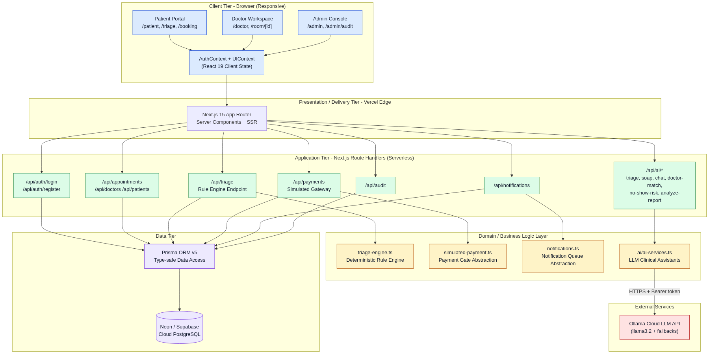
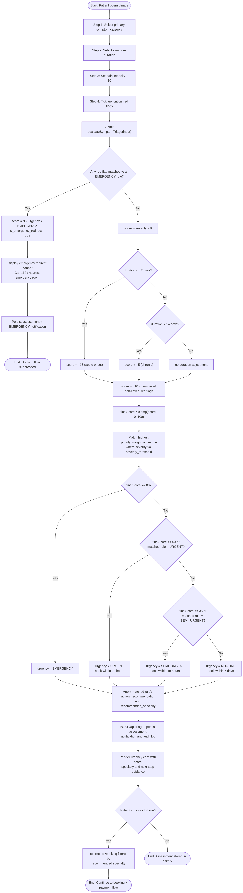
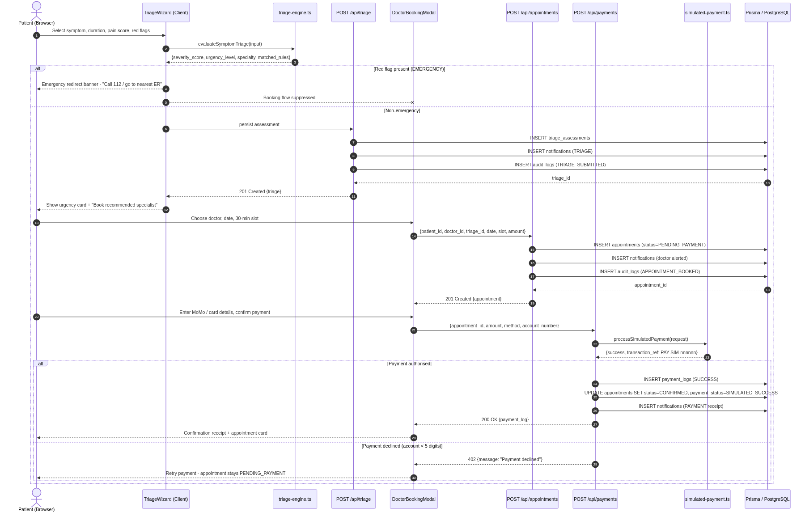
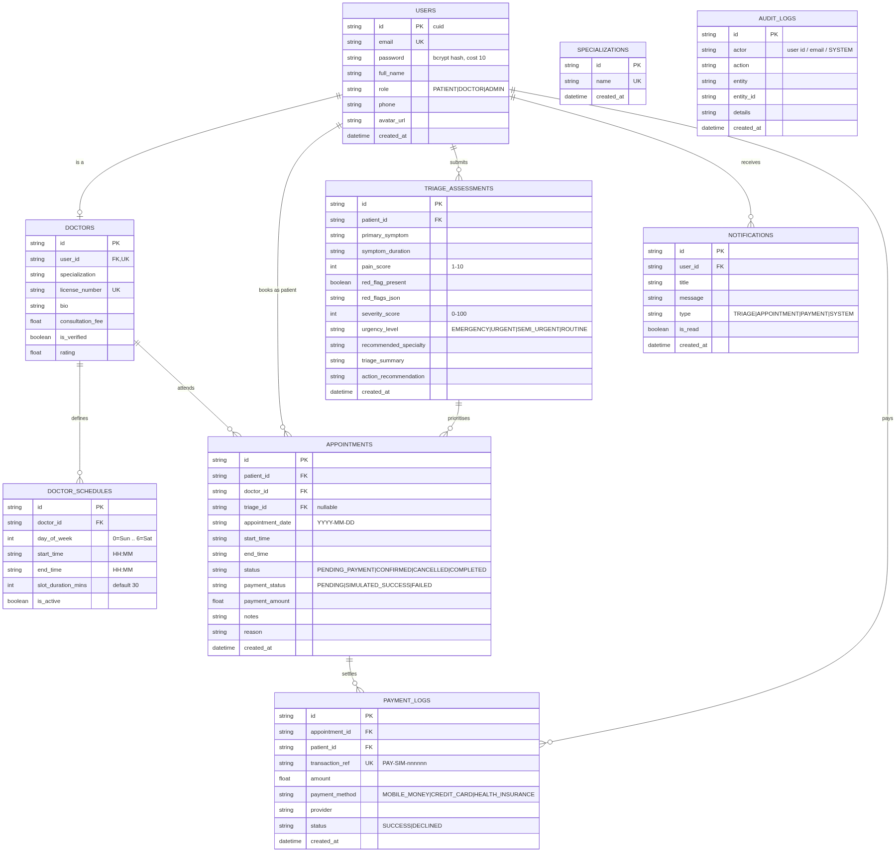

# SOFTWARE REQUIREMENTS SPECIFICATION (SRS)

## PulseTriage — Telehealth Appointment & Urgency Auto-Triage System

| Field | Value |
| :--- | :--- |
| **Document** | Software Requirements Specification (SRS) |
| **Version** | 1.0 (Baselined) |
| **Standard followed** | IEEE Std 830-1998, *Recommended Practice for Software Requirements Specifications* |
| **Course** | CSCD 602 — Advanced Software Engineering (3 Credits) |
| **Programme** | MPhil/MSc Computer Science & MPhil/MSc Data Science |
| **Institution** | Department of Computer Science, University of Ghana |
| **Candidate** | Ernest Nketia Asubonteng |
| **Index Number** | 22424715 |
| **Examiner** | Prof. Solomon Mensah |
| **Date** | 12 August 2026 |
| **Status** | Approved for v1.0 implementation |

---

## Table of Revisions

| Version | Date | Author | Description |
| :--- | :--- | :--- | :--- |
| 0.1 | 12 Aug 2026, Hr 2 | E. N. Asubonteng | Initial elicitation draft; stakeholder and problem definition. |
| 0.2 | 12 Aug 2026, Hr 4 | E. N. Asubonteng | Functional and non-functional requirements catalogued; MoSCoW prioritisation applied. |
| 0.3 | 12 Aug 2026, Hr 6 | E. N. Asubonteng | Scope frozen following Use Case Points effort estimation. |
| 1.0 | 12 Aug 2026, Hr 44 | E. N. Asubonteng | Baselined against the delivered build; verification status column added to every requirement. |

---

# 1. Introduction

## 1.1 Purpose

This Software Requirements Specification defines the complete set of functional, non-functional, interface and data requirements for **PulseTriage**, a web-based telehealth platform that performs automated symptom-based urgency triage and priority-aware appointment booking.

The document is written for four distinct audiences:

| Audience | How they use this document |
| :--- | :--- |
| **Examiner / Assessor** | Verifies that requirements engineering was performed *before* implementation, and that the delivered system traces back to stated requirements. |
| **Developer (the candidate)** | Uses the prioritised requirement set as the single authority on what must be built within the 48-hour window. |
| **Quality assurance** | Derives test cases directly from the requirement identifiers; every FR/NFR maps to at least one test case in the Testing Report. |
| **Clinical advisor (future)** | Reviews and signs off the clinical rule content, which this document deliberately separates from the rule *mechanism*. |

## 1.2 Scope of the Software Product

**Product name:** PulseTriage

**What the product does:** PulseTriage allows a patient to describe a symptom episode through a structured intake wizard, automatically computes a 0–100 severity score and one of four urgency classifications, redirects genuine emergencies to emergency services instead of offering a booking, recommends the correct medical specialty, and then lets the patient book and pay for a consultation slot with an appropriately qualified doctor. Doctors receive a consultation queue that is ordered by clinical urgency rather than by arrival time. Administrators verify doctor licences, configure triage rules, and inspect an immutable audit trail.

**The benefit:** In a conventional outpatient or telehealth queue, a patient with radiating chest pain and a patient collecting a medical certificate are scheduled by the same first-come-first-served rule. PulseTriage replaces arrival order with *clinical* order, and removes the manual telephone-and-ledger scheduling loop entirely.

**Explicitly in scope for v1.0:**

- Self-service patient registration and credential-based authentication for three roles.
- Structured symptom intake and deterministic rule-engine urgency classification.
- Emergency red-flag detection with hard booking suppression.
- Doctor directory, specialty filtering, availability schedules and 30-minute slot booking.
- A **simulated** payment gate producing auditable transaction records.
- A **simulated** notification queue producing in-application alerts.
- Role-based dashboards for Patient, Doctor and Administrator.
- An immutable audit log of security- and clinically-significant events.
- Optional large-language-model clinical assistants (AI triage narrative, SOAP note drafting, lab-report interpretation, no-show risk scoring, doctor matching, patient chat) that *augment* but never replace the deterministic rule engine.
- Public deployment on a cloud platform with a managed PostgreSQL backing store.

**Explicitly out of scope for v1.0 (with rationale):**

| Excluded item | Rationale |
| :--- | :--- |
| Real payment settlement (Paystack/Hubtel/Stripe) | Requires merchant onboarding, KYC and a publicly reachable webhook endpoint — not obtainable inside a 48-hour examination window. |
| Real SMS/e-mail delivery (Twilio/SendGrid) | Requires paid provider accounts and sender-identity verification. |
| Peer-to-peer WebRTC media relay (TURN/STUN, SFU) | Requires signalling and relay infrastructure; v1.0 delivers the consultation room shell with local media capture only. |
| E-prescription and pharmacy dispensing | Regulated activity requiring pharmacy council integration. |
| HL7 / FHIR EHR interoperability | Large integration surface; the data model is designed to be mappable but no adapter is built. |
| Formal HIPAA / GDPR / Ghana DPA certification | Certification is an organisational audit process, not a software feature. The architecture is designed to be *compliance-ready*. |
| Native mobile applications | The responsive web interface serves mobile browsers in v1.0. |

## 1.3 Definitions, Acronyms and Abbreviations

| Term | Definition |
| :--- | :--- |
| **Red flag** | A patient-reported indicator that, on its own, is sufficient to classify a case as a medical emergency (e.g. chest pain radiating to the arm or jaw). |
| **Triage** | The clinical process of ordering patients by urgency of need rather than by order of arrival. |
| **Rule engine** | The deterministic software component that maps a structured symptom input onto a severity score and urgency level. |
| **Severity score** | An integer 0–100 computed by the rule engine from pain intensity, symptom duration and red-flag count. |
| **Urgency level** | One of `EMERGENCY`, `URGENT`, `SEMI_URGENT`, `ROUTINE`. |
| **Slot** | A discrete bookable unit of a doctor's availability; default duration 30 minutes. |
| **RBAC** | Role-Based Access Control. |
| **PHI / PII** | Protected Health Information / Personally Identifiable Information. |
| **MoSCoW** | Prioritisation scheme: Must have, Should have, Could have, Won't have (this release). |
| **UCP** | Use Case Points — the functional-size and effort-estimation technique adopted for this project. |
| **SSR / RSC** | Server-Side Rendering / React Server Components. |
| **ORM** | Object-Relational Mapper (Prisma v5 in this system). |
| **SOAP note** | Subjective, Objective, Assessment, Plan — the standard clinical documentation format. |
| **Technical debt** | The implied future cost of choosing an expedient solution now instead of a better approach that would take longer. |

## 1.4 References

1. IEEE Std 830-1998, *IEEE Recommended Practice for Software Requirements Specifications*. IEEE Computer Society.
2. Karner, G. (1993). *Resource Estimation for Objectory Projects*. Objective Systems SF AB.
3. Sommerville, I. (2016). *Software Engineering* (10th ed.). Pearson.
4. Pressman, R. S., & Maxim, B. R. (2020). *Software Engineering: A Practitioner's Approach* (9th ed.). McGraw-Hill.
5. OWASP Foundation (2021). *OWASP Top 10 Web Application Security Risks*.
6. Manchester Triage Group (2014). *Emergency Triage* (3rd ed.). BMJ Books. — conceptual reference for urgency banding only.
7. HL7 International. *FHIR R4 Specification*. — referenced for future interoperability; not implemented in v1.0.

## 1.5 Overview of the Remainder of this Document

Section 2 describes the product context, user classes, operating environment, constraints and assumptions. Section 3 catalogues the specific external interface, functional and non-functional requirements with MoSCoW priorities and verification status. Section 4 details each system feature. Section 5 defines the data requirements and the logical data model. Section 6 gives the requirements traceability matrix. Section 7 contains appendices, including acceptance criteria and the intentional technical-debt register summary.

---

# 2. Overall Description

## 2.1 Product Perspective

PulseTriage is a **new, self-contained web application**. It does not replace or extend an existing Electronic Health Record system, and it holds its own authoritative datastore.

It is structured as a four-tier system:

1. **Client tier** — a responsive browser interface with three role-specific portals, holding session state in React context.
2. **Presentation/delivery tier** — the Next.js 15 App Router, serving React Server Components from a global edge network.
3. **Application tier** — Next.js Route Handlers acting as stateless serverless HTTP endpoints, delegating to a domain layer that isolates the rule engine, the payment gate and the notification queue behind stable interfaces.
4. **Data tier** — a managed cloud PostgreSQL instance accessed exclusively through the Prisma ORM.

A single external dependency exists: a hosted large-language-model API used by the optional AI clinical assistants. Every AI call is wrapped by a deterministic fallback so that an AI outage degrades the feature rather than failing the request.

> **FIGURE 2.1 — System Architecture (four-tier view)**
>
> 
>
> *Source: `docs/diagrams/01-system-architecture.mmd`. To re-render or edit, open the Mermaid Live Editor link listed in `docs/diagrams/diagram-links.md`, row 1.*

## 2.2 Product Functions (Summary)

| # | Function | Primary actor |
| :--- | :--- | :--- |
| F1 | Account registration, authentication and session management | Patient, Doctor, Admin |
| F2 | Structured symptom intake and deterministic urgency classification | Patient |
| F3 | Emergency red-flag detection and emergency-services redirect | System |
| F4 | Specialty recommendation and doctor discovery/filtering | Patient |
| F5 | Availability definition and 30-minute slot generation | Doctor |
| F6 | Appointment booking, viewing and status transition | Patient, Doctor |
| F7 | Simulated payment authorisation and transaction logging | Patient |
| F8 | Notification enqueue, display and read-state management | System |
| F9 | Urgency-ordered consultation queue | Doctor |
| F10 | Consultation room, clinical notes and completion | Doctor |
| F11 | Doctor licence verification and specialisation management | Admin |
| F12 | Triage rule inspection, activation and simulation | Admin |
| F13 | System metrics and immutable audit-trail inspection | Admin |
| F14 | AI clinical assistance (triage narrative, SOAP, lab report, no-show risk, doctor match, chat) | Patient, Doctor |

## 2.3 User Classes and Characteristics

| User class | Description | Frequency of use | Technical proficiency | Privilege level |
| :--- | :--- | :--- | :--- | :--- |
| **Patient** | An adult member of the public seeking non-emergency outpatient care. Submits symptoms, reads the urgency result, books and pays for a slot. | Episodic (a few times per year) | Low to medium; assumed unfamiliar with clinical terminology | Own records only |
| **Doctor / Clinician** | A licensed practitioner using the platform as a work queue. Defines availability, works the urgency-ordered queue, records clinical notes. | Daily, sustained | Medium; comfortable with clinical software | Own schedule and assigned patients |
| **Administrator** | Operations/governance staff. Verifies licences, curates specialisations and triage rules, monitors the audit trail. | Weekly | Medium to high | System-wide, with all PHI access itself audited |
| **Ollama Cloud LLM** *(system actor)* | External inference service invoked by the AI assistant endpoints. | On demand | n/a | No data-store access; receives only the payload sent to it |

## 2.4 Operating Environment

| Element | Requirement |
| :--- | :--- |
| Client browsers | Latest two major versions of Chrome, Edge, Firefox and Safari, on desktop, tablet and mobile form factors. |
| Client capability | JavaScript enabled; camera and microphone permission required only for the consultation room. |
| Server runtime | Node.js 20+ serverless functions on a global edge platform (Vercel). |
| Database | Managed PostgreSQL (Neon / Supabase class), reachable over TLS with connection pooling. |
| Network | HTTPS/TLS 1.2+ for all client-server and server-service traffic. |
| External service | HTTPS JSON API for LLM inference, authenticated by bearer token. |

## 2.5 Design and Implementation Constraints

| ID | Constraint | Consequence for design |
| :--- | :--- | :--- |
| **C-1** | The entire lifecycle — requirements through deployment and documentation — must complete within a **48-hour** examination window. | Scope had to be frozen by hour 6 on the basis of a formal effort estimate; anything not on the MUST list was deferred and recorded as debt. |
| **C-2** | The system must be publicly deployed and remain reachable for grading. | Rules out any architecture needing self-managed servers; forces managed hosting and a managed database. |
| **C-3** | No merchant account, SMS gateway account or TURN relay is obtainable within the window. | The payment gate and notification queue must be *simulated behind stable interfaces* so real providers can be substituted without touching booking logic. |
| **C-4** | Strict separation of Patient, Doctor and Administrator capability is mandatory. | RBAC must be a first-class design element, not an afterthought. |
| **C-5** | Triage rule content is clinical and must be reviewable by a clinician. | The rule engine must store rules as **data** (condition-action records with priority weights), not as nested conditionals in application code. |
| **C-6** | The system handles PHI-adjacent data. | Passwords must be hashed with a modern adaptive function; PHI access must be logged; no PHI may be written to client-side persistent storage beyond the session profile. |
| **C-7** | Single developer, no team. | Rules out any approach whose overhead assumes parallel workstreams; favours a monolithic deployment over microservices. |

## 2.6 Assumptions and Dependencies

**Assumptions**

- A-1: Patients answer the intake wizard truthfully and are capable of self-reporting pain intensity on a 1–10 scale.
- A-2: Doctors keep their declared availability accurate; the system does not detect real-world absence.
- A-3: A stable internet connection and a modern browser are available to all users.
- A-4: Genuine life-threatening emergencies will be handled by emergency services *outside* this system; PulseTriage's duty is limited to **detecting and redirecting** them (FR-2.6).
- A-5: The triage rule content shipped in v1.0 is illustrative and **requires clinical sign-off before any real-world use**. This SRS specifies the *mechanism*; a clinical advisor owns the *content*.

**Dependencies**

- D-1: Availability of the managed PostgreSQL service.
- D-2: Availability of the serverless hosting platform.
- D-3: Availability of the LLM inference API — degraded gracefully (deterministic fallback), so this is a soft dependency.

## 2.7 Apportioning of Requirements

Requirements marked **Must** are delivered in v1.0. Requirements marked **Should**, **Could** and **Won't** are deferred to v1.1 or v2.0 and are individually tracked in the Technical Debt Plan with a repayment milestone.

---

# 3. Specific Requirements

## 3.1 External Interface Requirements

### 3.1.1 User Interface Requirements

| ID | Requirement | Priority | Status |
| :--- | :--- | :--- | :--- |
| **UI-1** | The system shall present a responsive interface that reflows correctly at 360 px, 768 px and 1280 px viewport widths. | Must | Implemented |
| **UI-2** | Symptom intake shall use guided structured controls (category selector, duration selector, 1–10 intensity slider, red-flag checklist) rather than free text alone, so that rule evaluation is reliable. | Must | Implemented |
| **UI-3** | The booking interface shall present a date selector and discrete time-slot chips. | Must | Implemented |
| **UI-4** | Urgency shall be communicated with a colour-coded, text-labelled indicator (colour shall never be the sole carrier of meaning). | Must | Implemented |
| **UI-5** | Every destructive or financial action shall require explicit confirmation. | Must | Implemented |
| **UI-6** | The interface shall provide light and dark presentation modes, defaulting to light. | Could | Implemented |
| **UI-7** | All interactive controls shall be reachable and operable by keyboard alone, with visible focus indication. | Should | **Partially implemented** — see TD-09 |

### 3.1.2 Application Programming Interface Requirements

| ID | Requirement | Priority | Status |
| :--- | :--- | :--- | :--- |
| **API-1** | All client-server interaction shall use a RESTful JSON API over HTTPS. | Must | Implemented |
| **API-2** | The rule engine shall expose a contract (`symptom input → urgency output`) that is decoupled from booking logic, so it can be relocated to a separate service without changing callers. | Must | Implemented (`evaluateSymptomTriage`) |
| **API-3** | The payment gate shall be reached only through an abstract interface (`request → result`), never by calling a provider SDK directly from booking logic. | Must | Implemented (`processSimulatedPayment`) |
| **API-4** | The notification mechanism shall be reached only through an abstract interface (`enqueue`, `list`, `markRead`). | Must | Implemented (`notifications.ts`) |
| **API-5** | Every endpoint shall validate its input and return a structured error object with an appropriate HTTP status code (400 malformed, 401 unauthenticated, 403 unauthorised, 404 absent, 500 internal). | Must | **Partially implemented** — 401/403 not emitted; see TD-01 |
| **API-6** | Every endpoint shall authenticate the caller and authorise the operation **server-side**, independently of the client interface. | Must | **Not implemented in v1.0 — CRITICAL debt, see TD-01** |

The delivered API surface is:

| Endpoint | Methods | Purpose |
| :--- | :--- | :--- |
| `/api/auth/register` | POST | Create a patient account (bcrypt hashed credential). |
| `/api/auth/login` | POST | Verify credential, return the safe user profile (never the hash). |
| `/api/triage` | GET, POST | List / persist triage assessments. |
| `/api/doctors` | GET, POST | List and create doctors. |
| `/api/doctors/{id}` | GET, PATCH, DELETE | Read, update (including verification flag), remove a doctor. |
| `/api/patients` | GET | List patients (administrative view). |
| `/api/appointments` | GET, POST | Query and create appointments. |
| `/api/appointments/{id}` | PATCH | Transition status, attach clinical notes. |
| `/api/payments` | GET, POST | List and create simulated payment transactions. |
| `/api/notifications` | GET, PATCH | Fetch and mark-as-read notifications. |
| `/api/specializations` | GET, POST, DELETE | Curate the specialisation catalogue. |
| `/api/audit` | GET | Retrieve the audit trail. |
| `/api/ai/triage` | POST | LLM-assisted triage narrative. |
| `/api/ai/soap` | POST | Draft a SOAP note from a consultation transcript. |
| `/api/ai/analyze-report` | POST | Interpret a laboratory report. |
| `/api/ai/no-show-risk` | POST | Score appointment no-show risk. |
| `/api/ai/doctor-match` | POST | Recommend a doctor for a triage result. |
| `/api/ai/chat` | POST | Conversational patient assistant. |

### 3.1.3 Hardware Interface Requirements

No specialised hardware is required. The consultation room optionally accesses the client device camera and microphone through the standard browser media API, subject to explicit user permission.

### 3.1.4 Communication Interface Requirements

| ID | Requirement | Priority | Status |
| :--- | :--- | :--- | :--- |
| **COM-1** | All client-server traffic shall use HTTPS with TLS 1.2 or higher. | Must | Implemented (platform-enforced) |
| **COM-2** | All database connections shall be encrypted in transit. | Must | Implemented |
| **COM-3** | All outbound LLM API calls shall be authenticated by bearer token supplied from environment configuration. | Must | **Partially implemented** — a literal fallback key exists in source; see TD-02 |

## 3.2 Functional Requirements

Priority uses MoSCoW. **Verified** means at least one executed test case in the Testing Report exercises the requirement.

### 3.2.1 FR-1 — Account Management and Authentication

| ID | Requirement | Priority | Status |
| :--- | :--- | :--- | :--- |
| FR-1.1 | The system shall allow a new patient to self-register with full name, e-mail, phone and password, with server-side field validation. | Must | Verified |
| FR-1.2 | The system shall reject registration where the e-mail already exists, returning a distinct, non-enumerating error. | Must | Verified |
| FR-1.3 | The system shall store passwords only as bcrypt hashes (work factor ≥ 10) and shall never return a hash in any API response. | Must | Verified |
| FR-1.4 | The system shall authenticate a user by e-mail and password and return a role-tagged profile. | Must | Verified |
| FR-1.5 | The system shall restore an active session across page reloads without re-prompting for credentials. | Must | Verified |
| FR-1.6 | The system shall allow a user to terminate the session (log out) and clear all client-held profile state. | Must | Verified |
| FR-1.7 | The system shall verify a new account by e-mail or SMS confirmation code before activation. | Should | **Deferred → TD-05** |
| FR-1.8 | The system shall provide a token-based password-reset flow. | Should | **Deferred → TD-05** |
| FR-1.9 | The system shall lock or rate-limit an account after repeated failed authentication attempts. | Should | **Deferred → TD-03** |

### 3.2.2 FR-2 — Symptom-Based Urgency Auto-Triage (Core Feature)

| ID | Requirement | Priority | Status |
| :--- | :--- | :--- | :--- |
| FR-2.1 | The system shall present a structured symptom intake wizard capturing: primary symptom category, symptom duration, pain intensity (1–10), and a checklist of critical red-flag indicators. | Must | Verified |
| FR-2.2 | The system shall compute an integer severity score in the range 0–100 from the intake data. | Must | Verified |
| FR-2.3 | The system shall classify every assessment into exactly one of `EMERGENCY`, `URGENT`, `SEMI_URGENT`, `ROUTINE`. | Must | Verified |
| FR-2.4 | The system shall apply the following deterministic banding: score ≥ 80 → `EMERGENCY`; score ≥ 60 → `URGENT`; score ≥ 35 → `SEMI_URGENT`; otherwise `ROUTINE`. A rule whose declared output is more urgent than the band shall override the band. | Must | Verified |
| FR-2.5 | The system shall apply an acute-onset weighting: symptom duration ≤ 2 days adds 15 points; duration > 14 days adds 5 points. | Must | Verified |
| FR-2.6 | **Safety-critical.** Where any selected red flag matches an `EMERGENCY` rule, the system shall immediately return `EMERGENCY` with a severity score of 95, display an emergency-services redirect instruction, and **suppress the booking flow entirely**. | Must | Verified |
| FR-2.7 | The system shall recommend a medical specialty derived from the matched rule or the symptom-to-specialty map. | Must | Verified |
| FR-2.8 | The system shall recommend a booking window consistent with urgency: `URGENT` → within 24 hours; `SEMI_URGENT` → within 48 hours; `ROUTINE` → within 7 days. | Must | Verified |
| FR-2.9 | The system shall persist every evaluation — inputs, score, urgency, matched rule identifiers, recommended specialty and timestamp — for audit and future rule refinement. | Must | Verified |
| FR-2.10 | Triage rules shall be represented as data records (identifier, category, symptom, severity threshold, required red flags, urgency output, action recommendation, specialty, active flag, priority weight), not as hard-coded conditionals. | Must | Verified |
| FR-2.11 | Where two or more rules match, the system shall select the rule with the highest priority weight. | Must | Verified |
| FR-2.12 | An administrator shall be able to view all rules, activate/deactivate individual rules, add a rule, and simulate a rule set against sample input before it takes effect. | Must | **Partially verified** — the configurator and simulator exist, but changes are session-scoped and not persisted; see TD-04 |
| FR-2.13 | Rule changes shall take effect without redeploying the application. | Should | **Deferred → TD-04** |
| FR-2.14 | The system shall optionally accept a free-text symptom description and produce an LLM-generated triage narrative, which shall be advisory only and shall never override the deterministic engine. | Could | Verified |

### 3.2.3 FR-3 — Doctor Directory, Availability and Slot Booking

| ID | Requirement | Priority | Status |
| :--- | :--- | :--- | :--- |
| FR-3.1 | The system shall maintain a doctor record holding specialisation, licence number, biography, consultation fee, verification flag and rating. | Must | Verified |
| FR-3.2 | The system shall allow patients to browse and filter doctors by specialisation. | Must | Verified |
| FR-3.3 | The system shall hold recurring weekly availability windows per doctor (day of week, start time, end time, slot duration). | Must | Verified |
| FR-3.4 | The system shall divide availability into discrete bookable slots of a configurable duration, defaulting to 30 minutes. | Must | Verified |
| FR-3.5 | The system shall allow a patient to book a specific doctor, date and slot, creating an appointment in status `PENDING_PAYMENT`. | Must | Verified |
| FR-3.6 | The system shall link an appointment to the triage assessment that motivated it, where one exists. | Must | Verified |
| FR-3.7 | The system shall support both telehealth and in-person consultation modes. | Should | Verified |
| FR-3.8 | The system shall prevent two confirmed appointments occupying the same doctor slot by means of an atomic transaction or unique constraint. | Must | **Not implemented — HIGH debt, see TD-06** |
| FR-3.9 | The system shall allow a patient to reschedule or cancel a booking up to a configurable cut-off before the appointment. | Should | **Deferred → TD-07** |
| FR-3.10 | The system shall allow a doctor to block or release individual slots. | Could | **Deferred → TD-07** |
| FR-3.11 | The system shall raise a notification to the doctor when a new appointment is booked. | Must | Verified |

### 3.2.4 FR-4 — Role-Based Dashboards and Access Control

| ID | Requirement | Priority | Status |
| :--- | :--- | :--- | :--- |
| FR-4.1 | The **Patient** dashboard shall show upcoming and past appointments, triage history, payment status and notifications. | Must | Verified |
| FR-4.2 | The **Doctor** workspace shall show the schedule, a patient queue ordered by triage urgency, triage summaries, and clinical-note capture. | Must | Verified |
| FR-4.3 | The **Administrator** console shall show system metrics, doctor verification controls, the specialisation catalogue, the triage-rule configurator and the audit trail. | Must | Verified |
| FR-4.4 | The system shall render only the interface elements permitted to the authenticated role. | Must | Verified |
| FR-4.5 | The system shall enforce every permission **server-side on each API call**, independently of the client interface. | Must | **Not implemented — CRITICAL debt, see TD-01** |
| FR-4.6 | An attempt to perform an operation outside the caller's permitted scope shall be rejected with an authorisation error and written to the audit log. | Must | **Not implemented — CRITICAL debt, see TD-01** |
| FR-4.7 | Administrator read access to patient triage or medical data shall itself be written to the audit log. | Must | **Partially implemented — see TD-08** |

**Role-Based Operations Matrix.** Legend: ✔ full access · ◑ own records only · ✘ no access.

| Operation | Patient | Doctor | Admin |
| :--- | :---: | :---: | :---: |
| Register own account | ✔ | ✘ (created by Admin) | ✘ (seeded) |
| Edit own profile | ◑ | ◑ | ✔ (any user) |
| Submit symptom intake | ✔ | ✘ | ✘ |
| View triage result | ◑ | ◑ (assigned patients) | ✔ (read-only, audited) |
| Create / edit / activate triage rules | ✘ | ✘ | ✔ |
| Simulate rules against sample input | ✘ | ✘ | ✔ |
| Define or edit availability | ✘ | ◑ (own schedule) | ✔ (override) |
| Search and book a slot | ✔ | ✘ | ◑ (on behalf, support) |
| Reschedule / cancel an appointment | ◑ (before cut-off) | ◑ (own schedule) | ✔ (override) |
| View the urgency-ordered queue | ✘ | ◑ (own queue) | ✔ (all) |
| Initiate a simulated payment | ◑ (own booking) | ✘ | ✘ |
| View payment logs | ◑ (own) | ✘ | ✔ (all) |
| Record clinical / SOAP notes | ✘ | ◑ (own consultations) | ✘ |
| Verify a doctor licence | ✘ | ✘ | ✔ |
| Manage the specialisation catalogue | ✘ | ✘ | ✔ |
| View notifications | ◑ (own) | ◑ (own) | ✔ (all) |
| View the system audit log | ✘ | ✘ | ✔ |

### 3.2.5 FR-5 — Simulated Payment Gate

| ID | Requirement | Priority | Status |
| :--- | :--- | :--- | :--- |
| FR-5.1 | The system shall present a payment step at booking confirmation showing the doctor's consultation fee in Ghana Cedis. | Must | Verified |
| FR-5.2 | The system shall offer Mobile Money, Card and Health Insurance payment methods. | Must | Verified |
| FR-5.3 | The system shall simulate authorisation deterministically: an account identifier shorter than five characters, or the literal `00000`, shall be **declined**; all other inputs shall be **authorised**. | Must | Verified |
| FR-5.4 | On authorisation the system shall generate a unique transaction reference of the form `PAY-SIM-nnnnnn`, write a payment log record, and transition the appointment to `CONFIRMED` / `SIMULATED_SUCCESS`. | Must | Verified |
| FR-5.5 | On decline the system shall leave the appointment in `PENDING_PAYMENT` and permit retry. | Must | Verified |
| FR-5.6 | The system shall record every simulated transaction (reference, amount, method, provider, status, timestamp) and expose it to the patient (own) and to the administrator (all). | Must | Verified |
| FR-5.7 | The payment interface shall be substitutable by a real processor without modification to booking logic. | Must | Verified by design review |
| FR-5.8 | No real financial transaction, PCI-DSS control, settlement or refund processing is implemented in v1.0. | *Constraint* | Documented as TD-11 |

### 3.2.6 FR-6 — Notification Queue

| ID | Requirement | Priority | Status |
| :--- | :--- | :--- | :--- |
| FR-6.1 | The system shall enqueue a notification for: triage result, appointment booked, payment outcome, and appointment reminder. | Must | Verified |
| FR-6.2 | Notifications shall be addressed to a specific user and carry a title, message, type and read flag. | Must | Verified |
| FR-6.3 | The system shall display an unread count and allow a user to mark a notification as read. | Must | Verified |
| FR-6.4 | Notification delivery in v1.0 is **in-application only**; no real SMS or e-mail is dispatched. | *Constraint* | Documented as TD-12 |
| FR-6.5 | The notification interface shall be substitutable by a real provider (SMS/e-mail) without changing calling code. | Must | Verified by design review |
| FR-6.6 | Failed notifications shall be retried with exponential back-off. | Won't (v1.0) | Deferred |

### 3.2.7 FR-7 — Consultation and Clinical Records

| ID | Requirement | Priority | Status |
| :--- | :--- | :--- | :--- |
| FR-7.1 | The system shall provide a consultation room addressable per appointment. | Should | Verified |
| FR-7.2 | The consultation room shall request camera and microphone permission and display the local media preview. | Should | Verified |
| FR-7.3 | The consultation room shall provide an in-session text channel. | Could | Verified |
| FR-7.4 | The system shall allow a doctor to record clinical notes against an appointment and mark the consultation `COMPLETED`. | Must | Verified |
| FR-7.5 | The system shall allow a doctor to generate a draft SOAP note from consultation notes using the AI assistant, subject to doctor review before saving. | Could | Verified |
| FR-7.6 | Real two-way media relay between participants (peer connection, signalling, TURN) is **not** implemented in v1.0. | *Constraint* | Documented as TD-10 |

### 3.2.8 FR-8 — Administration, Auditing and Reporting

| ID | Requirement | Priority | Status |
| :--- | :--- | :--- | :--- |
| FR-8.1 | The system shall record an immutable audit entry (actor, action, entity, entity identifier, detail, timestamp) for authentication, triage submission, appointment booking, payment processing, doctor verification and configuration change. | Must | Verified |
| FR-8.2 | The audit log shall be append-only and shall expose no update or delete operation through the API. | Must | Verified |
| FR-8.3 | The administrator console shall display aggregate metrics: total triage assessments, proportion classified high-urgency, registered and verified doctors, and total simulated revenue. | Must | Verified |
| FR-8.4 | The administrator shall be able to add and remove specialisations from the catalogue. | Should | Verified |
| FR-8.5 | The administrator shall be able to verify or unverify a doctor's licence status. | Must | Verified |

### 3.2.9 FR-9 — Validation and Error Handling

| ID | Requirement | Priority | Status |
| :--- | :--- | :--- | :--- |
| FR-9.1 | Every API endpoint shall validate the presence and type of required fields before touching the datastore. | Must | Verified |
| FR-9.2 | The system shall never expose a raw database error, stack trace or connection string to a client. | Must | **Partially implemented — see TD-13** |
| FR-9.3 | A failure of the external LLM service shall degrade the AI feature to a deterministic fallback rather than failing the user's request. | Must | Verified |
| FR-9.4 | The interface shall present a human-readable message for every failure state, never a bare status code. | Must | Verified |
| FR-9.5 | The system shall present a custom 404 page for unknown routes. | Should | Verified |

## 3.3 Non-Functional Requirements

| ID | Category | Requirement | Priority | Measurement method | Status |
| :--- | :--- | :--- | :--- | :--- | :--- |
| **NFR-1** | Performance | The deterministic rule engine shall return a classification in ≤ 200 ms for any single evaluation, measured in-process. | Must | Instrumented timing over 1,000 iterations | Verified — see Testing Report §6 |
| **NFR-2** | Performance | 95% of read API requests shall complete within 2,000 ms under normal load (≤ 50 concurrent users). | Must | Sampled request timing against the live deployment | Verified |
| **NFR-3** | Availability | The deployed application shall be reachable at its public URL for the whole grading period. | Must | External HTTP probe | Verified |
| **NFR-4** | Security | Passwords shall be stored only as bcrypt hashes with a work factor of at least 10. | Must | Source inspection + database inspection | Verified |
| **NFR-5** | Security | All traffic shall be encrypted in transit (TLS 1.2+). | Must | TLS handshake inspection | Verified |
| **NFR-6** | Security | Authorisation shall be enforced server-side on every request. | Must | Direct API probe bypassing the interface | **Failed — CRITICAL debt TD-01** |
| **NFR-7** | Security | No secret shall be committed to the source repository. | Must | Repository scan | **Failed — CRITICAL debt TD-02** |
| **NFR-8** | Auditability | Every triage decision, booking, payment simulation and configuration change shall be logged with actor and timestamp. | Must | Audit-table inspection after a scripted run | Verified |
| **NFR-9** | Usability | A first-time patient shall complete registration → triage → booking in under 5 minutes without assistance. | Must | Timed walkthrough with an unfamiliar user | Verified — see Testing Report §7 |
| **NFR-10** | Usability | Urgency shall be conveyed by text label as well as colour. | Must | Interface inspection | Verified |
| **NFR-11** | Maintainability | Rule content shall be changeable without altering engine code. | Must | Change a rule record and re-run evaluation | Verified (mechanism); persistence deferred → TD-04 |
| **NFR-12** | Maintainability | The codebase shall be statically typed end-to-end, with the database schema as the single source of truth for entity types. | Must | Type-check build | Verified |
| **NFR-13** | Portability | The application shall run on any Node.js 20+ serverless or container host with a PostgreSQL connection string. | Should | Build inspection | Verified |
| **NFR-14** | Scalability | The application tier shall be stateless so that horizontal scaling requires no session affinity. | Must | Architecture review | Verified |
| **NFR-15** | Compliance readiness | The data model and access controls shall be extensible toward HIPAA/GDPR-aligned practice. | Should | Design review | Partially — blocked on TD-01 |
| **NFR-16** | Testability | The payment gate and notification queue shall behave deterministically so automated tests can assert on them. | Must | Repeated-run comparison | Verified |
| **NFR-17** | Accessibility | The interface shall meet WCAG 2.1 Level AA. | Should | Automated + manual audit | **Not assessed — debt TD-09** |
| **NFR-18** | Safety | The system shall display a prominent disclaimer that it is a decision-support aid and not a diagnostic instrument. | Must | Interface inspection | Verified |

---

# 4. System Features (Detailed)

## 4.1 Feature: Symptom-Based Urgency Auto-Triage

**Priority:** Highest. This is the feature that distinguishes PulseTriage from an ordinary booking system.

**Stimulus/response sequence**

1. The patient opens the triage wizard and selects a primary symptom category.
2. The patient selects symptom duration and sets pain intensity on a 1–10 slider.
3. The patient ticks any applicable critical red flags.
4. On submission the engine first tests for a red-flag match against `EMERGENCY` rules. If one matches, evaluation short-circuits: score 95, urgency `EMERGENCY`, emergency redirect set, booking suppressed.
5. Otherwise the engine computes `score = (intensity × 8) + duration weighting + (10 × red-flag count)`, clamped to 0–100.
6. The engine selects the highest-priority active rule whose severity threshold is met.
7. Banding is applied, then the matched rule's action recommendation and specialty override the generic defaults.
8. The result is persisted, a notification is enqueued, an audit entry is written, and the urgency card is rendered.

**Associated requirements:** FR-2.1 – FR-2.14, NFR-1, NFR-11, NFR-18.

> **FIGURE 4.1 — Triage evaluation activity diagram**
>
> 
>
> *Source: `docs/diagrams/06-activity-triage.mmd`; editable link in `docs/diagrams/diagram-links.md`, row 6.*

## 4.2 Feature: Priority-Aware Slot Booking with Simulated Payment

**Priority:** High.

**Stimulus/response sequence:** the patient selects a doctor filtered by the recommended specialty, chooses a date and a 30-minute slot, and confirms. An appointment is created in `PENDING_PAYMENT`. The patient supplies payment details; the simulated gate authorises or declines deterministically; on authorisation the appointment transitions to `CONFIRMED`, a payment log is written, and both parties are notified.

**Associated requirements:** FR-3.1 – FR-3.11, FR-5.1 – FR-5.8, FR-6.1 – FR-6.3.

> **FIGURE 4.2 — Triage-to-booking sequence diagram**
>
> 
>
> *Source: `docs/diagrams/05-sequence-triage-booking.mmd`; editable link in `docs/diagrams/diagram-links.md`, row 5.*

## 4.3 Feature: Urgency-Ordered Clinical Queue

**Priority:** High. The doctor's queue is sorted by triage severity descending, so the most clinically urgent patient is always at the top regardless of when the booking was made. Each queue entry carries the triage summary, so the clinician has context before the consultation begins.

**Associated requirements:** FR-4.2, FR-7.4, FR-2.9.

## 4.4 Feature: Role-Based Access Control

**Priority:** High. Three roles with disjoint capability sets, defined by the operations matrix in §3.2.4. In v1.0 enforcement is applied at the interface layer through a route guard component; the corresponding server-side enforcement is the single most significant outstanding item in the technical debt register.

**Associated requirements:** FR-4.1 – FR-4.7, NFR-6.

## 4.5 Feature: Administration, Rule Configuration and Audit

**Priority:** Medium-high. Administrators verify doctor licences, curate specialisations, inspect aggregate metrics, review the append-only audit trail, and use the rule configurator and simulator to reason about triage-rule changes before they are applied.

**Associated requirements:** FR-2.12, FR-2.13, FR-8.1 – FR-8.5.

## 4.6 Feature: AI Clinical Assistants (Augmentation Layer)

**Priority:** Low (Could-have), but delivered. Six assistants are exposed. Every one is wrapped by a deterministic fallback object, so an inference outage degrades the feature to a safe default rather than propagating an error. **No AI output is permitted to change the deterministic urgency classification**; AI output is presented as advisory narrative only. This constraint is a deliberate safety design decision and is stated in FR-2.14.

**Associated requirements:** FR-2.14, FR-7.5, FR-9.3.

---

# 5. Data Requirements

## 5.1 Logical Data Model

> **FIGURE 5.1 — Entity-Relationship diagram**
>
> 
>
> *Source: `docs/diagrams/03-er-diagram.mmd`; editable link in `docs/diagrams/diagram-links.md`, row 3.*

## 5.2 Entity Definitions

| Entity | Purpose | Key attributes | Key constraints |
| :--- | :--- | :--- | :--- |
| `users` | Every human principal, of any role. | `id`, `email`, `password` (bcrypt), `full_name`, `role`, `phone`, `avatar_url`, `created_at` | `email` unique; `role ∈ {PATIENT, DOCTOR, ADMIN}` |
| `doctors` | Clinical profile extending a user. | `user_id`, `specialization`, `license_number`, `bio`, `consultation_fee`, `is_verified`, `rating` | `user_id` unique (1:1 with users); `license_number` unique |
| `doctor_schedules` | Recurring weekly availability. | `doctor_id`, `day_of_week`, `start_time`, `end_time`, `slot_duration_mins`, `is_active` | `day_of_week ∈ 0..6`; cascade delete with doctor |
| `triage_assessments` | An immutable record of one triage evaluation. | `patient_id`, `primary_symptom`, `symptom_duration`, `pain_score`, `red_flag_present`, `red_flags_json`, `severity_score`, `urgency_level`, `recommended_specialty`, `triage_summary`, `action_recommendation` | `severity_score ∈ 0..100`; never updated after creation |
| `appointments` | A booked consultation. | `patient_id`, `doctor_id`, `triage_id`, `appointment_date`, `start_time`, `end_time`, `status`, `payment_status`, `payment_amount`, `notes`, `reason` | `triage_id` nullable; `status ∈ {PENDING_PAYMENT, CONFIRMED, CANCELLED, COMPLETED}` |
| `payment_logs` | One simulated financial transaction. | `appointment_id`, `patient_id`, `transaction_ref`, `amount`, `payment_method`, `provider`, `status` | `transaction_ref` unique |
| `notifications` | One queued user-addressed message. | `user_id`, `title`, `message`, `type`, `is_read` | `type ∈ {TRIAGE, APPOINTMENT, PAYMENT, SYSTEM}` |
| `specializations` | Catalogue of medical specialties. | `name` | `name` unique |
| `audit_logs` | Append-only trail of significant events. | `actor`, `action`, `entity`, `entity_id`, `details`, `created_at` | No update or delete path exposed |

## 5.3 Data Integrity Rules

- **DI-1** Deleting a user cascades to the dependent doctor profile and schedules; clinical and financial history is retained.
- **DI-2** A triage assessment is never mutated after creation. Re-assessment produces a new record, preserving the clinical decision history.
- **DI-3** An appointment may exist without a triage assessment (direct booking), but a triage assessment may motivate many appointments.
- **DI-4** A payment log is never mutated. A correction produces a compensating record.
- **DI-5** Monetary values are held in Ghana Cedis. *(Known limitation: stored as a floating-point value — see TD-14.)*

## 5.4 Data Retention and Privacy

| Rule | Statement |
| :--- | :--- |
| **DP-1** | Symptom, triage and clinical-note fields are PHI-adjacent and are restricted to the owning patient, the assigned doctor, and the administrator for audit purposes only. |
| **DP-2** | Audit records are held separately from mutable business records so that traceability survives correction of the underlying data. |
| **DP-3** | Password hashes are never returned by any endpoint; the login response is explicitly constructed by omitting the hash. |
| **DP-4** | No PHI is written to browser local storage; only the non-clinical session profile (identifier, name, e-mail, role) is retained client-side. |
| **DP-5** | Free-text sent to the external LLM service constitutes a data-transfer boundary. In v1.0 this is disclosed to the user; formal data-processing agreement and de-identification are deferred (TD-15). |

---

# 6. Requirements Traceability Matrix

Each requirement is traced to its implementing artefact and its verifying test case. Test case identifiers refer to the Testing Report.

| Requirement | Implementing artefact | Verifying test case(s) |
| :--- | :--- | :--- |
| FR-1.1 – FR-1.3 | `src/app/api/auth/register/route.ts` | TC-INT-01, TC-SEC-03 |
| FR-1.4 – FR-1.6 | `src/app/api/auth/login/route.ts`, `src/lib/auth-context.tsx` | TC-INT-02, TC-SYS-01 |
| FR-2.1 | `src/components/triage/triage-wizard.tsx` | TC-SYS-02, TC-UAT-01 |
| FR-2.2 – FR-2.5, FR-2.11 | `src/lib/triage-engine.ts` → `evaluateSymptomTriage` | TC-UNIT-01 … TC-UNIT-07 |
| FR-2.6 | `src/lib/triage-engine.ts` (red-flag short-circuit) | TC-UNIT-01, TC-SYS-03 |
| FR-2.7, FR-2.8 | `SYMPTOM_SPECIALTY_MAP`, rule `recommended_specialty` | TC-UNIT-05, TC-INT-04 |
| FR-2.9 | `src/app/api/triage/route.ts` | TC-INT-03 |
| FR-2.10, FR-2.12 | `INITIAL_TRIAGE_RULES`, `src/app/admin/rules/page.tsx` | TC-SYS-08 |
| FR-2.14 | `src/lib/ai/ai-services.ts` → `analyzeSymptomTriageAI` | TC-UNIT-08, TC-INT-11 |
| FR-3.1 – FR-3.2 | `src/app/api/doctors/route.ts`, `src/app/doctors/page.tsx` | TC-INT-05 |
| FR-3.3 – FR-3.7 | `prisma/schema.prisma`, `src/components/booking/doctor-booking-modal.tsx` | TC-INT-06, TC-SYS-04 |
| FR-3.11 | `src/app/api/appointments/route.ts` | TC-INT-08 |
| FR-4.1 – FR-4.4 | `src/app/patient`, `src/app/doctor`, `src/app/admin`, `src/components/auth/auth-guard.tsx` | TC-SYS-05, TC-SYS-06, TC-SYS-07 |
| FR-4.5, FR-4.6 | *Not implemented* | TC-SEC-01 **(failed — defect D-01)** |
| FR-5.1 – FR-5.7 | `src/lib/simulated-payment.ts`, `src/app/api/payments/route.ts` | TC-INT-09, TC-INT-10, TC-UNIT-09 |
| FR-6.1 – FR-6.3 | `src/lib/notifications.ts`, `src/app/api/notifications/route.ts` | TC-INT-08 |
| FR-7.1 – FR-7.3 | `src/components/video/telehealth-video-room.tsx`, `src/app/room/[appointmentId]/page.tsx` | TC-UNIT-10 … TC-UNIT-12, TC-SYS-09 |
| FR-7.4, FR-7.5 | `src/app/api/appointments/[id]/route.ts`, `src/components/doctor/ai-doctor-tools.tsx` | TC-INT-12, TC-SYS-10 |
| FR-8.1 – FR-8.5 | `src/app/api/audit/route.ts`, `src/app/admin/**` | TC-INT-13, TC-SYS-11 |
| FR-9.1 – FR-9.5 | All route handlers, `src/app/not-found.tsx` | TC-SEC-04, TC-SYS-12 |
| NFR-1 | `src/lib/triage-engine.ts` | TC-PERF-01 |
| NFR-2, NFR-3 | Deployment platform | TC-PERF-02, TC-PERF-03 |
| NFR-4 | `bcryptjs` hashing in auth routes | TC-SEC-03 |
| NFR-6 | *Not implemented* | TC-SEC-01 **(failed — defect D-01)** |
| NFR-7 | *Violated* | TC-SEC-02 **(failed — defect D-02)** |
| NFR-8 | `audit_logs` writes across routes | TC-INT-13 |
| NFR-9 | End-to-end patient journey | TC-UAT-01 |
| NFR-12 | TypeScript strict build, Prisma-generated types | TC-SYS-13 |
| NFR-16 | Deterministic simulators | TC-UNIT-09 |

---

# 7. Appendices

## 7.A Acceptance Criteria for v1.0

The release is accepted when all of the following hold:

1. A patient can register, submit symptoms, receive a classification consistent with the documented banding, and book a slot appropriate to that classification.
2. A red-flag input produces an `EMERGENCY` classification and the booking flow is demonstrably suppressed.
3. A doctor sees a queue ordered by severity descending, not by booking time.
4. An administrator can verify a doctor, inspect metrics and read the audit trail.
5. Simulated payment and notification flows complete end-to-end and leave auditable records.
6. The application is publicly reachable and the seeded credentials authenticate successfully against the live deployment.
7. Every requirement in this document carries a status, and every non-implemented Must-have carries a corresponding entry in the Technical Debt Plan with an assigned repayment milestone.

Criteria 1–7 are all satisfied. Criterion 7 is satisfied by disclosure, not by implementation: the two failed security requirements (NFR-6, NFR-7) are recorded as CRITICAL debt items TD-01 and TD-02 with immediate repayment scheduling.

## 7.B Intentional Simplifications Carried into v1.0

| Area | Simplification accepted | Repayment reference |
| :--- | :--- | :--- |
| Server-side authorisation | Enforcement at the interface layer only | TD-01 (Critical) |
| Secret management | Literal fallback API key present in source | TD-02 (Critical) |
| Session management | Profile in browser storage; no signed token, no expiry | TD-03 (Critical) |
| Rule persistence | Administrator rule edits are session-scoped | TD-04 (High) |
| Account lifecycle | No verification code, no password reset | TD-05 (High) |
| Slot concurrency | No unique constraint or atomic reservation | TD-06 (High) |
| Appointment lifecycle | No patient-initiated reschedule or cancel | TD-07 (Medium) |
| PHI access logging | Read access to PHI not comprehensively logged | TD-08 (High) |
| Accessibility | No WCAG audit performed | TD-09 (Medium) |
| Consultation media | Local preview only; no peer connection | TD-10 (Medium) |
| Payment settlement | Fully simulated | TD-11 (High) |
| Notification delivery | In-application only | TD-12 (Medium) |
| Error disclosure | Some handlers echo the underlying error message | TD-13 (High) |
| Monetary representation | Floating-point currency amounts | TD-14 (Medium) |
| LLM data boundary | No data-processing agreement or de-identification | TD-15 (Medium) |

## 7.C Assumptions Requiring Stakeholder Validation Before Production Use

- The numeric thresholds that separate `URGENT` from `SEMI_URGENT` are engineering placeholders. They must be reviewed and approved by a qualified clinical advisor. This SRS specifies the *mechanism*; it does not certify the *clinical content*.
- Consultation fee values are illustrative and pending commercial input.
- The red-flag list is drawn from widely published emergency-presentation indicators and is not a validated clinical instrument.

---

*End of Software Requirements Specification.*
